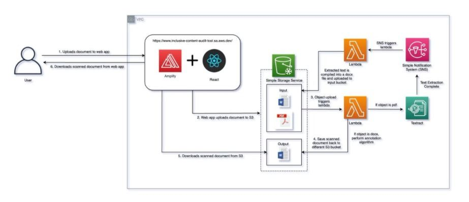

# Inclusive Content Audit Tool (ICAT) 
Internal tool built for Amazon Web Services (AWS) to push tech inclusion

ICAT helps to promote inclusive content in both internal and client-facing documentations by providing a fuss-free mechanism to scan through your documents uploaded to S3. A findings report is appended to the end of the document which highlights the words flagged, the number of words flagged, as well as proposed alternatives for the flagged words.

## How does ICAT work?
ICAT uses AWS textract to scan through your documents uploaded to S3 and highlights potentially offensive words for your reconsideration. A findings report is also generated and appended to the end of your document.

## How does the annotation algorithm work?

The text annotation algorithm used in ICAT flags text based off a pre-defined set of potentially offensive words according to the official [AWS Style Guide](https://alpha-docs-aws.amazon.com/awsstyleguide/latest/styleguide/inclusive.html). 

The set of potentially offensive words are as follows: 

| **Flagged Words** | **Recommendations** |
| ------------- | ------------- |
|abort | stop |
| blacklist | deny list |
|execute| start, run |
|hang | stop responding|
|kill | end, stop|
|master | primary, main, leader |
|slave | replica, secondary, standby |
|whitelist| allow list |

*Note: According to the style guide, if there is a term that is more appropriate for your service than the following suggestions, then use the more appropriate term.*

We will do our best to continually update the project with every new update of the style guide. 

## Architecture 

### What is the Architecture Diagram of ICAT? 

ICAT utilises the following AWS Services: AWS S3, Lambda, Textract and Simple Notification System (SNS).

## Security

### What happens to documents uploaded to ICAT? 
In order to maintain the security and confidentality of the documents uploaded to ICAT, the following mechanisms ensures that documents do not stay on the platform for a prolonged period of time:

1. Upon completed processing of the uploaded document, a lambda function is triggered to remove the original document from the S3 Bucket.

2. In edge cases where documents are unable to complete processing due to an error, those documents are scheduled to be removed from the S3 Bucket through a [scheduled EventsBridge Rule](https://docs.aws.amazon.com/eventbridge/latest/userguide/eb-create-rule-schedule.html).

## Contact

### What are the future plans for the project and how can I contribute? 
There are many ideas for improving and extending this project; Below is a short, but incomplete list. Feel free to reach out if you would like to contribute!
* Add support for additional file formats such as .pptx and .xslx
* Add support for text detection and extraction from images
* Allows user to customize words to flag to tailor to specific use-case
